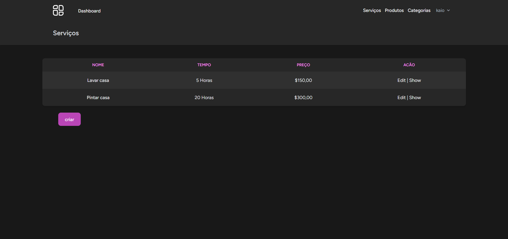
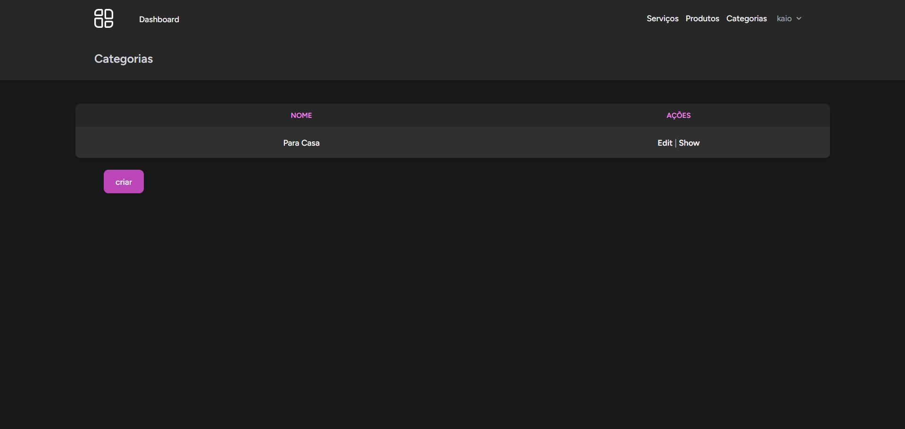
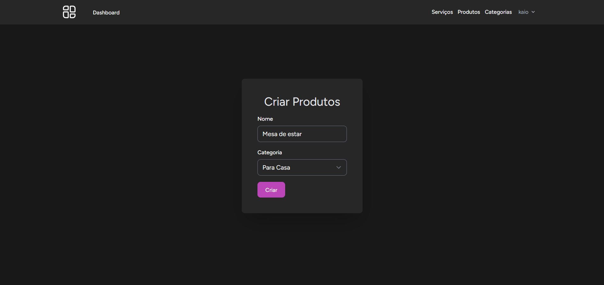

## Sobre o projeto

Esse projeto foi criado para colocar em prática o conhecimentos adquirido nas aulas sobre Laravel do nosso professor do curso.

O objetivo do projeto foi criar 3 Cruds simples no Laravel
    

## Layout do projeto

    

    

    

## Tecnologias utilizadas

    
    
    
    

## Contatos

